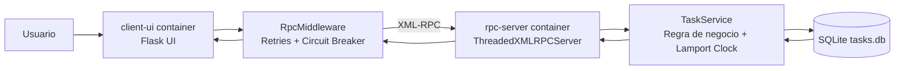

# Projeto de Sistemas Distribuidos (2 containers)

Aplicacao distribuida de **quadro de tarefas compartilhado** com 2 containers que se comunicam por RPC.

## Arquitetura

- `client-ui` (Camada de Apresentacao): interface web Flask.
- `rpc-server` (Camada de Negocios + Persistencia): servidor RPC XML-RPC multithread com banco SQLite.

Mesmo com 2 containers, a separacao em camadas foi mantida no codigo:
- Apresentacao: `client-ui/app.py` + HTML
- Negocios: `server/business/task_service.py`
- Persistencia: `server/persistence/repository.py`

## Diagrama Mermaid



## Requisitos atendidos

### Comunicacao e Middleware
- **Protocolo RPC/RMI**: XML-RPC (`xmlrpc.client` e `xmlrpc.server`).
- **Abstracao sem socket no cliente**: UI usa `RpcMiddleware` (`client-ui/middleware/rpc_client.py`), sem manipular sockets diretamente.

### Arquitetura
- **N-camadas**: apresentacao, negocio e persistencia separados.
- **Concorrencia**: `ThreadedXMLRPCServer` atende multiplos clientes simultaneamente.

### Caracteristicas de SD implementadas (2)
1. **Tolerancia a falhas**
   - Retries automaticos com backoff no cliente.
   - Circuit Breaker (estados `closed/open/half_open`) no middleware.
2. **Sincronizacao com relogio logico**
   - Relogio de Lamport no servidor (`server/domain/lamport.py`).
   - Escritas protegidas por lock para evitar corrida em recurso compartilhado.

## Como executar

### 1) Subir os containers

```bash
docker compose up --build
```

### 2) Acessar a UI

- Abra: `http://localhost:8000`

### 3) Testar distribuicao

- Abra duas abas/navegadores para simular clientes diferentes.
- Crie/conclua/exclua tarefas e veja o estado compartilhado.
- O clock logico aparece na interface para mostrar ordenacao causal.

## Estrutura do projeto

```text
.
├── client-ui/
│   ├── app.py
│   ├── middleware/rpc_client.py
│   ├── templates/index.html
│   └── Dockerfile
├── server/
│   ├── app.py
│   ├── business/task_service.py
│   ├── persistence/repository.py
│   ├── domain/lamport.py
│   └── Dockerfile
└── docker-compose.yml
```

## Observacoes

- Banco SQLite persiste no volume Docker `rpc_data`.
- O servidor exporta os metodos: `list_tasks`, `create_task`, `toggle_task`, `delete_task`, `get_server_clock`.
